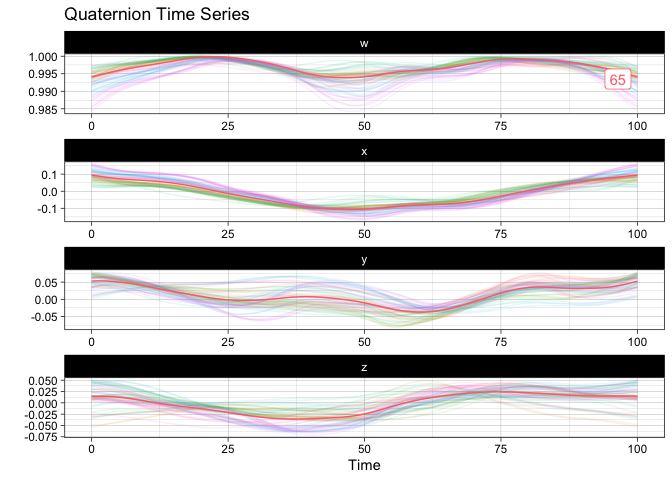
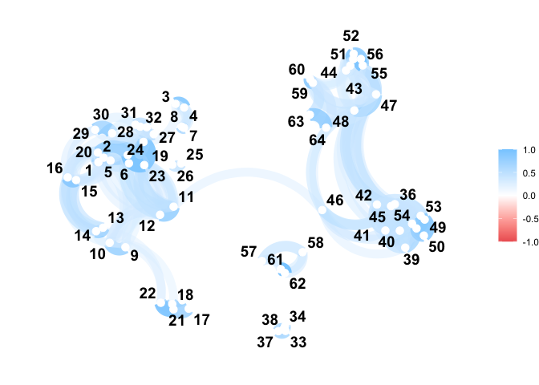
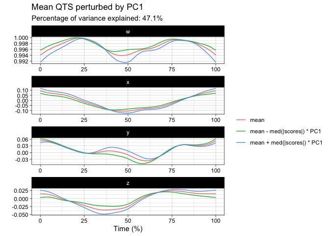
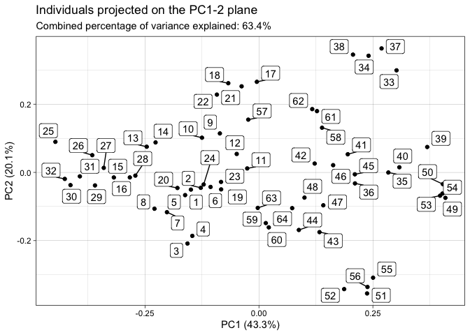
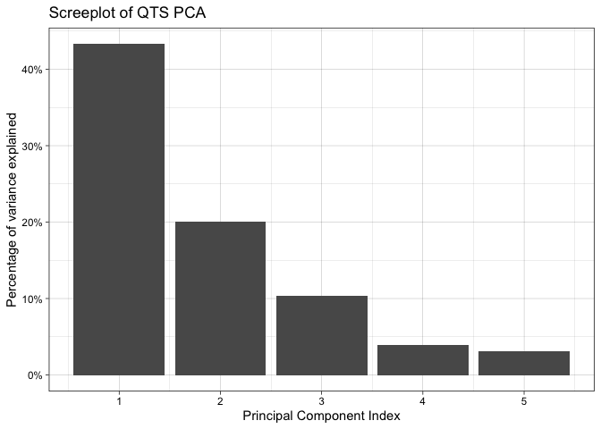
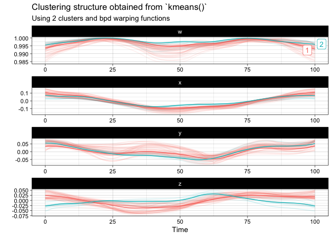

<!-- README.md is generated from README.Rmd. Please edit that file -->

# squat

<!-- badges: start -->

[](https://github.com/LMJL-Alea/squat/actions)
[](https://github.com/LMJL-Alea/squat/actions)
[](https://app.codecov.io/gh/LMJL-Alea/squat?branch=master)
[](https://github.com/LMJL-Alea/squat/actions)
[](https://CRAN.R-project.org/package=squat)
<!-- badges: end -->

The goal of squat is to provide extensions of common statistical methods
for the analysis of unit quaternion time series. Available statistical
methods for QTS samples are currently:

- random generation according to the Gaussian functional model via
  [`rnorm_qts()`](https://lmjl-alea.github.io/squat/reference/rnorm_qts.html),
- [`scale()`](https://lmjl-alea.github.io/squat/reference/scale.html),
- [`mean()`](https://lmjl-alea.github.io/squat/reference/mean.qts_sample.html),
- [`median()`](https://lmjl-alea.github.io/squat/reference/median.qts_sample.html),
- distance matrix computation via
  [`dist()`](https://lmjl-alea.github.io/squat/reference/dist.html)
  including the possibility of separating amplitude and phase
  variability,
- tangent principal component analysis via
  [`prcomp()`](https://lmjl-alea.github.io/squat/reference/prcomp.qts_sample.html),
- k-means with optional alignment via
  [`kmeans()`](https://lmjl-alea.github.io/squat/reference/kmeans.html).

## Installation

You can install the official version from CRAN via:

``` r
install.packages("squat")
```

or you can opt to install the development version from
[GitHub](https://github.com/) with:

``` r
# install.packages("devtools")
devtools::install_github("LMJL-Alea/squat")
```

## Example

``` r
library(squat)
```

First, let us visualize the sample of QTS from the `vespa64` dataset
included in the package. The package provides two ways of doing this:
either via a static plot or via an animated one (which uses
[**gganimate**](https://gganimate.com) behind the scenes and will prompt
you to install it in case you have not already).

Here is the static version:

``` r
plot(vespa64$igp)
```


You can also use `ggplot2::autoplot()` instead of `plot()` to save the
resulting `ggplot` object for further customization.

Here is the animated version:

``` r
p <- ggplot2::autoplot(vespa64$igp, with_animation = TRUE)
gganimate::anim_save("man/figures/README-animated-plot.gif", p)
```

You can compute the geometric mean of the sample and append it to the
sample for visualization:

``` r
m <- mean(vespa64$igp)
sample_and_mean <- append(vespa64$igp, m)
plot(sample_and_mean, highlighted = c(rep(FALSE, 64), TRUE))
```



You can compute the pairwise distance matrix (based on the DTW for now):

``` r
D <- dist(vespa64$igp, metric = "l2", warping_class = "srsf")
C <- exp(-D / (sqrt(2) * sd(D)))
C <- (C - min(C)) / diff(range(C))
C <- C |> 
  as.matrix() |> 
  corrr::as_cordf()
corrr::network_plot(C)
#> Warning: ggrepel: 1 unlabeled data points (too many overlaps). Consider
#> increasing max.overlaps
```



You can perform tangent principal component analysis and visualize it:

``` r
tpca <- prcomp(vespa64$igp)
plot(tpca, what = "PC1")
#> The `original_space` boolean argument is not specified. Defaulting to TRUE.
```



``` r
plot(tpca, what = "scores")
#> The `plane` length-2 integer vector argument is not specified. Defaulting to
#> 1:2.
```



``` r
screeplot(tpca)
```



You can finally perform a k-means clustering and visualize it:

``` r
km <- kmeans(vespa64$igp, n_clusters = 2, warping_class = "srsf")
#> ℹ Computing initial centroids using kmeans++ strategy...
#> ℹ Running iteration 1...
#> ℹ ----> Alignment step
#> ℹ ----> Assignment step
#> ℹ ----> Normalisation step
#> ℹ ----> Template identification step
#> ℹ Consolidating output...
plot(km)
```


